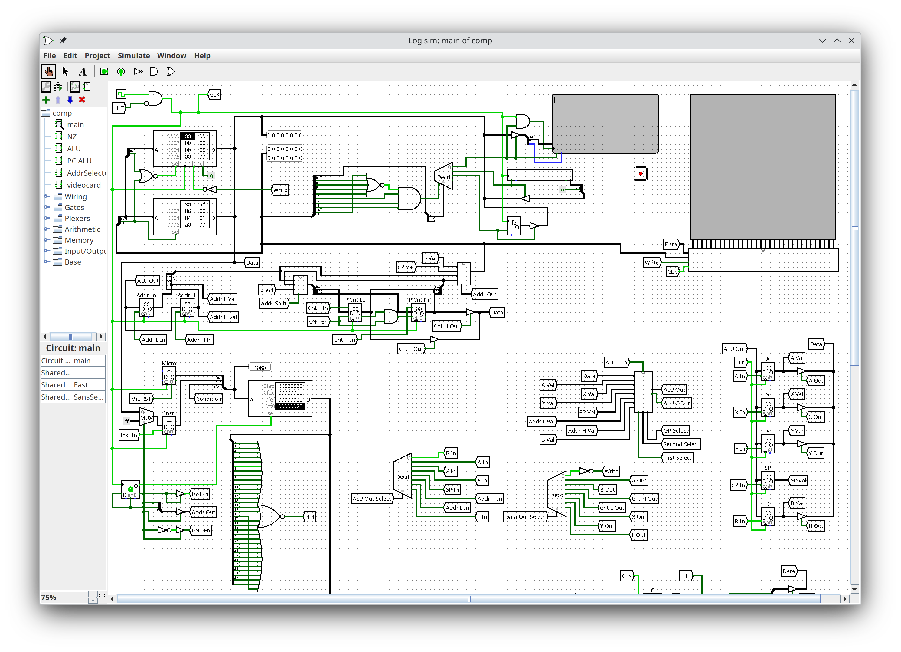

This computer has a tty and graphical display. 
You can see how "comp.circ" looks like opened in Logisim:

The microcode for the CPU was generated from "tools/microcodeSpec.yaml" by "tools/microcodeGen.py".

PNG images were converted by "tools/imageConvert.py".
